Welcome to the mermaid page.

## What is Mermaid? 

Mermaid is a `JavaScript-based` diagramming and charting tool that uses Markdown-inspired text definitions and a renderer to create and modify complex diagrams. The main purpose of Mermaid is to help documentation catch up with development.

## How to use Mermaid with Lotus Docs 

Mermaid is enabled whenever content containing Mermaid diagram syntax is present in a page’s content. You can insert Mermaid diagrams by using the mermaid language identifier with triple backtick codeblocks:



 ```mermaid
---
title: Advanded graph
---
sequenceDiagram
Alice->>John: Hello John, how are you?
loop Healthcheck
    John->>John: Fight against hypochondria
end
Note right of John: Rational thoughts!
John-->>Alice: Great!
John->>Bob: How about you?
Bob-->>John: Jolly good! 
```


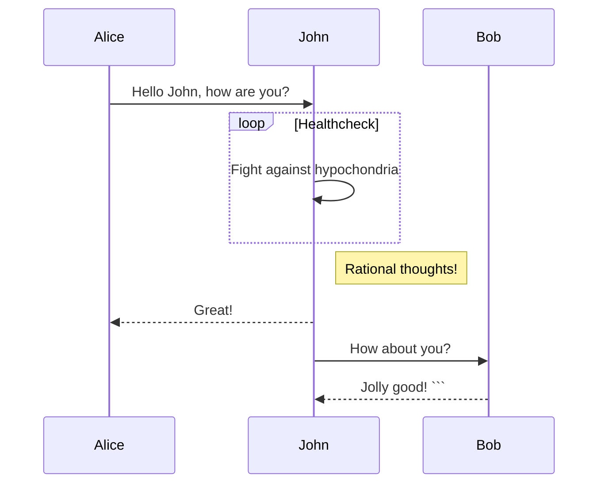

This is a more adavanced diagram, so lets scale it back to a simple flowchart.

---

## Flowchart

### What is a flowchart

A flowchart is a graphical representation of a process or workflow, depicting the sequence of steps, decisions, and actions involved. It typically consists of shapes, arrows, and text, illustrating the flow of control through a system.

Flowcharts are used across various domains to visually map out procedures, analyze processes, and communicate complex workflows.

### Create nodes

As mentioned before, flowchart are composed by nodes. To create a node:


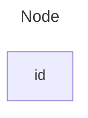



### Basic Flowchart

The most basic flowchart consist of creating an implication of x to y.


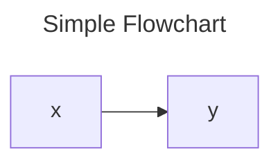



### One to Many Flowchart


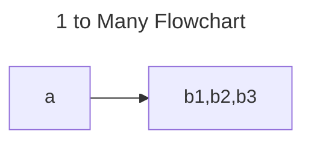



### Costumize Flowchart

There are various ways to costumize a flowchart, from chaging the nodes shape, changing orientation to adding colors and icons.



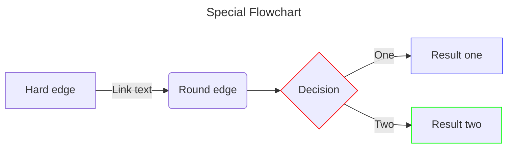



---



## Pie Chart diagram


### What is a Pie Chart

A pie chart is a circular statistical graphic divided into slices to illustrate numerical proportions. Each slice represents a proportionate part of the whole data set, typically displayed as a percentage of the total. Pie charts are commonly used to visualize data distribution and show the relative size of different categories or components within a dataset. 

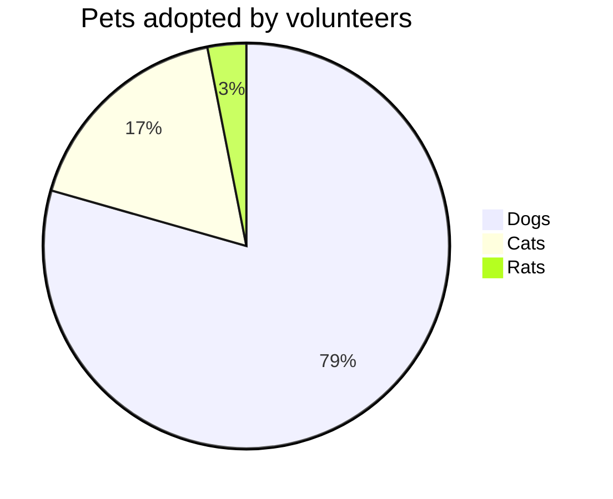

### Pie Chart Syntax

Drawing a pie chart is really simple in mermaid.

* Start with pie keyword to begin the diagram
* showData to render the actual data values after the legend text. This is OPTIONAL
* Followed by title keyword and its value in string to give a title to the pie-chart. This is OPTIONAL
* Followed by dataSet. Pie slices will be ordered clockwise in the same order as the labels.
* label for a section in the pie diagram within " " quotes.
* Followed by : colon as separator
* Followed by positive numeric value (supported up to two decimal places)

---



### Basic Pie Chart






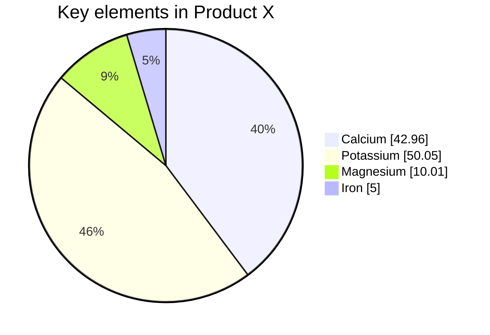

---

## Quadrant Chart

### What is a Quadrant Chart

A quadrant chart is a graphical representation that divides data into four quadrants based on two axes. Each axis represents a different dimension or variable, and the quadrants are defined by dividing the chart area into four equal sections. 

Quadrant charts are commonly used to analyze and visualize data relationships, particularly when comparing two sets of variables or criteria. They help identify patterns, trends, and outliers within the dataset, allowing users to categorize data points into different quadrants based on their positions relative to the axes

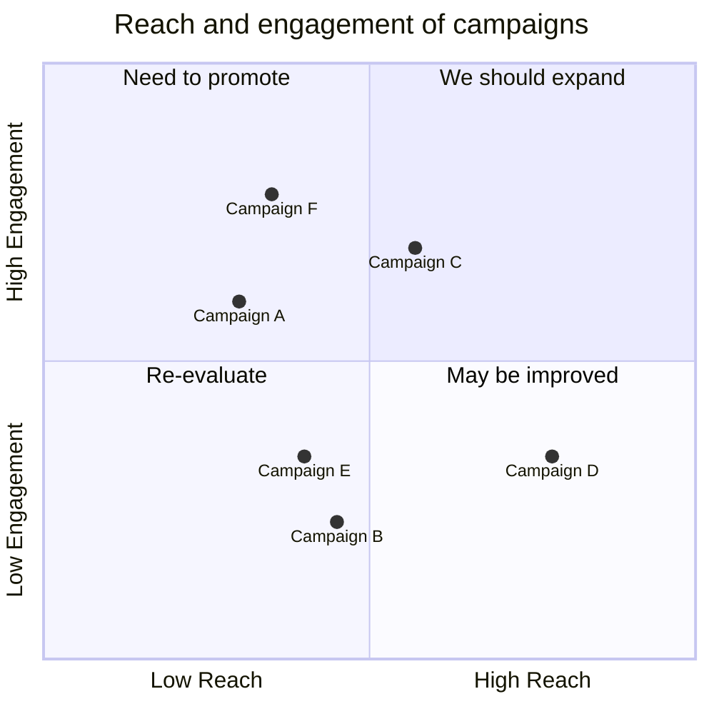

---

### Quadrant Chart Syntax 

Title
The title is a short description of the chart and it will always render on top of the chart.

Example
quadrantChart
    title This is a sample example

* `x-axis`
The x-axis determines what text would be displayed in the x-axis. In x-axis there is two part left and right you can pass both or you can pass only left. The statement should start with x-axis then the left axis text followed by the delimiter --> then right axis text.

Example
x-axis <text> --> <text> both the left and right axis text will be rendered.
x-axis <text> only the left axis text will be rendered.

* `y-axis`
The y-axis determines what text would be displayed in the y-axis. In y-axis there is two part top and bottom you can pass both or you can pass only bottom. The statement should start with y-axis then the bottom axis text followed by the delimiter --> then top axis text.

Example
y-axis <text> --> <text> both the bottom and top axis text will be rendered.
y-axis <text> only the bottom axis text will be rendered.

* `Quadrants text`
The quadrant-[1,2,3,4] determine what text would be displayed inside the quadrants.

Example
quadrant-1 <text> determine what text will be rendered inside the top right quadrant.
quadrant-2 <text> determine what text will be rendered inside the top left quadrant.
quadrant-3 <text> determine what text will be rendered inside the bottom left quadrant.
quadrant-4 <text> determine what text will be rendered inside the bottom right quadrant.

* `Points`
Points are used to plot a circle inside the quadrantChart. The syntax is <text>: [x, y] here x and y value is in the range 0 - 1.

Example
Point 1: [0.75, 0.80] here the Point 1 will be drawn in the top right quadrant.
Point 2: [0.35, 0.24] here the Point 2 will be drawn in the bottom left quadrant.

---



### Basic Quadrant Chart 

Code:


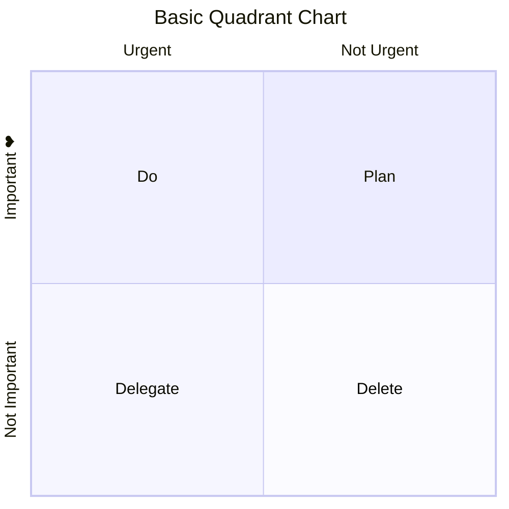



--- 

## Class Diagram
### What is a Class Diagram

A class diagram is a type of UML (Unified Modeling Language) diagram that represents the structure of a system by depicting the classes of objects within it, their attributes, methods, and the relationships between them. 

Class diagrams are used primarily in software engineering and system design to visualize the structure of object-oriented systems. They provide a blueprint for designing software applications, helping developers understand the relationships between different classes, plan the implementation of code, and ensure consistency and clarity in the design process.

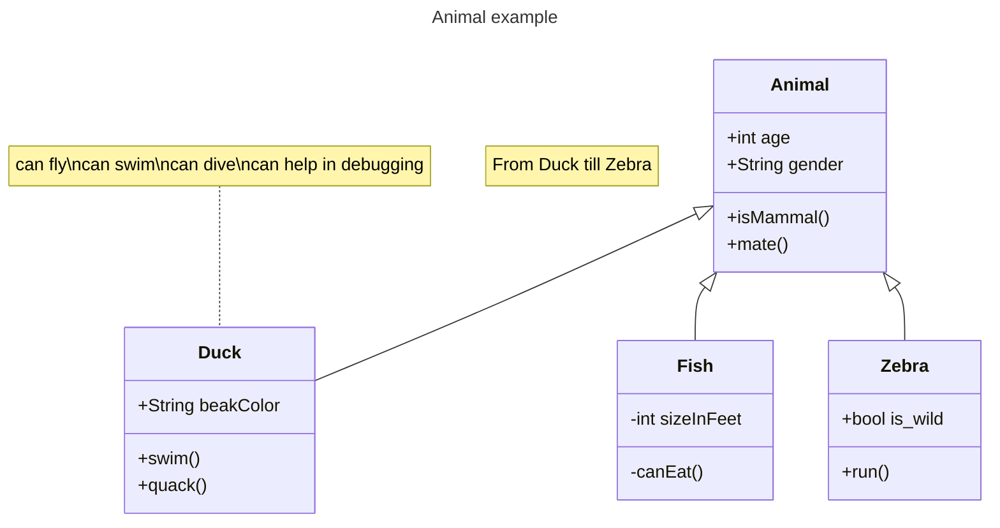

--- 

### Class Diagram Syntax

* UML provides mechanisms to represent class members, such as attributes and methods, and additional information about them. A single instance of a class in the diagram contains three compartments:

* The top compartment contains the name of the class. It is printed in bold and centered, and the first letter is capitalized. It may also contain optional annotation text describing the nature of the class.

* The middle compartment contains the attributes of the class. They are left-aligned and the first letter is lowercase.

* The bottom compartment contains the operations the class can execute. They are also left-aligned and the first letter is lowercase.

---



### Basic Class Diagram


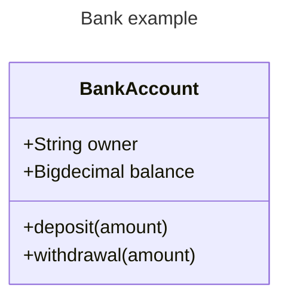



---

## Timeline Diagram
### What is a Timeline Diagram

A Timeline Diagram is a visual representation that displays events, tasks, or milestones along a chronological axis. It typically consists of horizontal bars or lines representing the duration or occurrence of each event, with labels or markers indicating key points in time. 

Timeline diagrams are used to illustrate the sequence of events or activities over a period, providing a clear and concise overview of temporal relationships. They are commonly utilized in project management, historical analysis, storytelling, and process visualization

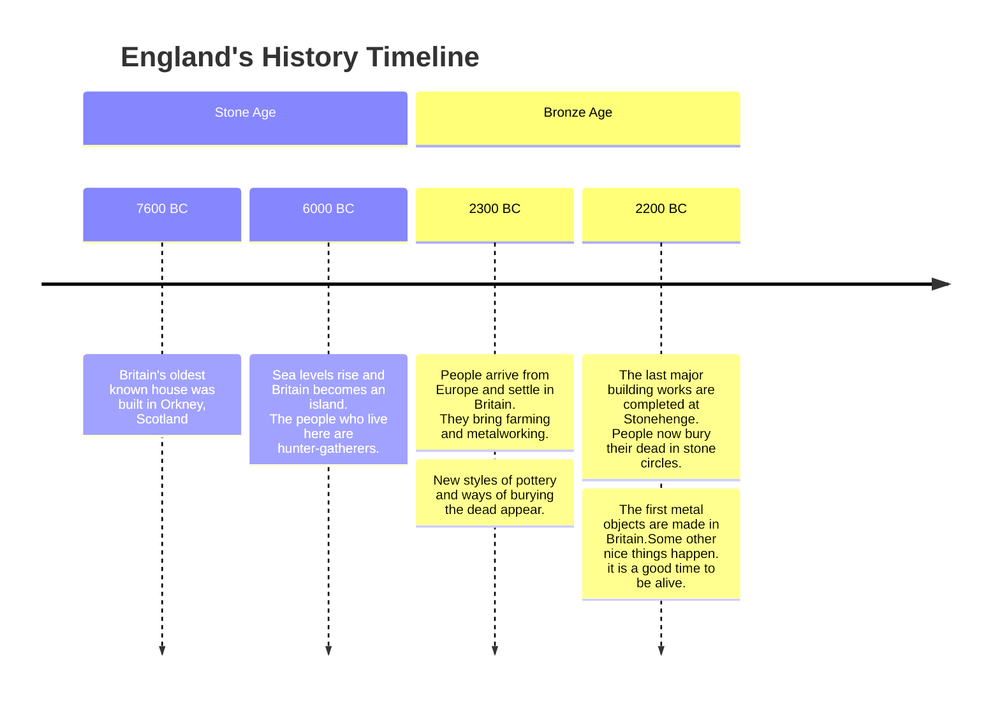

### Timeline Diagram Synxtax

* The syntax for creating Timeline diagram is simple. You always start with the timeline keyword to let mermaid know that you want to create a timeline diagram.

* After that there is a possibility to add a title to the timeline. This is done by adding a line with the keyword title followed by the title text.

* Then you add the timeline data, where you always start with a time period, followed by a colon and then the text for the event. Optionally you can add a second colon and then the text for the event. So, you can have one or more events per time period.

---



### Basic Timeline Diagram


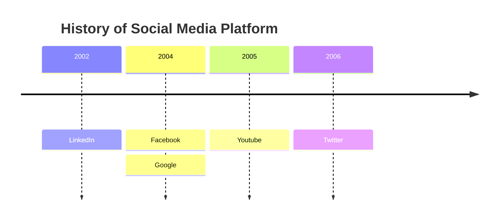


```mermaid
timeline
    title History of Social Media Platform
    2002 : LinkedIn
    2004 : Facebook : Google
    2005 : Youtube
    2006 : Twitter
```
