Bem-vindo à página sobre Mermaid.

## O que é o Mermaid? 

Mermaid é uma ferramenta de construção de diagramas e gráficos `baseada em JavaScript` que usa definições de texto com base na syntax Markdown e um renderizador para criar e modificar diagramas complexos. O principal objetivo do Mermaid é ajudar a documentação a acompanhar o desenvolvimento.

## Como usar o Mermaid com o Lotus Docs 

O Mermaid é ativado sempre que o conteúdo que contém a sintaxe do diagrama Mermaid está presente no conteúdo de uma página. É possível inserir diagramas Mermaid utilizando o identificador de linguagem Mermaid com blocos de código de "`" triplos:



 ```mermaid
---
title: Gráfico avançado
---
sequenceDiagram
Alice->>João: Olá João como estás?
loop Estado de saúde
    João->>João: Fight against hypochondria
end
Note right of João: Rational thoughts!
João-->>Alice: Ótimo!
João->>Pedro: Então e tu?
Pedro-->>João: Muito bem! 
```



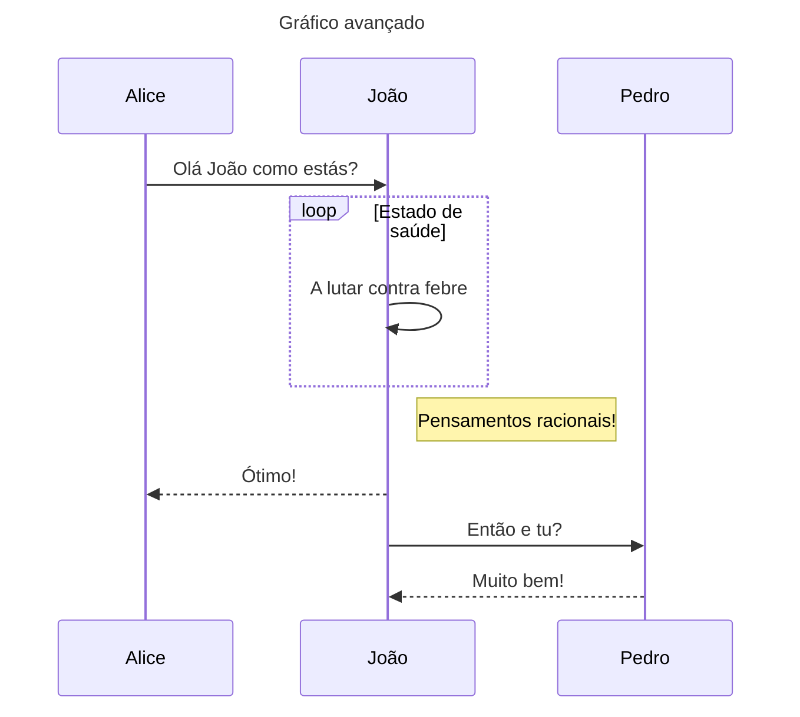

Este é um diagrama mais avançado, por isso vamos reduzi-lo a um simples fluxograma.

---

## Fluxograma

### O que é um Fluxograma

Um fluxograma é uma representação gráfica de um processo ou fluxo de trabalho, descrevendo a sequência de etapas, decisões e ações envolvidas. Normalmente, consiste em formas, setas e texto, ilustrando o fluxo de controlo através de um sistema.

Os fluxogramas são utilizados em vários domínios para criar uma mapa visual de procedimentos, analisar processos e comunicar fluxos de trabalho complexos.

### Criar Nós

Como já foi referido, os fluxogramas são compostos por nós. 

Para criar um nó:


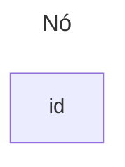



### Fluxograma básico

O fluxograma mais básico consiste em criar uma implicação de x para y.


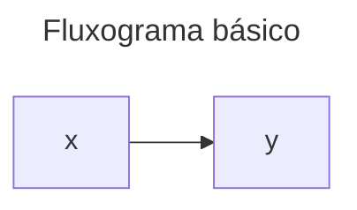



### Fluxograma de 1 para Muitos


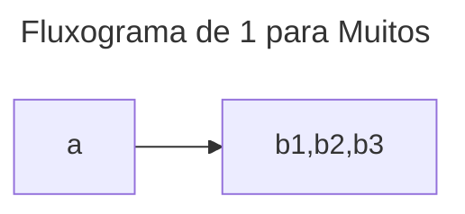



### Costumizar o Flowchart

Existem várias formas de personalizar um fluxograma, desde alterar a forma dos nós, mudar a orientação e  até adicionar cores e ícones.






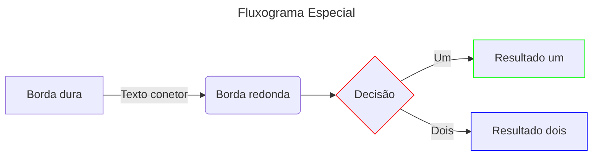
---



## Gráfico Circulrar

### O que é um gráfico circular

Um Gráfico Circular é um gráfico estatístico circular dividido em fatias para ilustrar proporções numéricas. Cada fatia representa uma parte proporcional de todo o conjunto de dados, normalmente apresentada como uma percentagem do total. Os gráficos de pizza são normalmente utilizados para visualizar a distribuição de dados e mostrar a dimensão relativa de diferentes categorias ou componentes num conjunto de dados. 

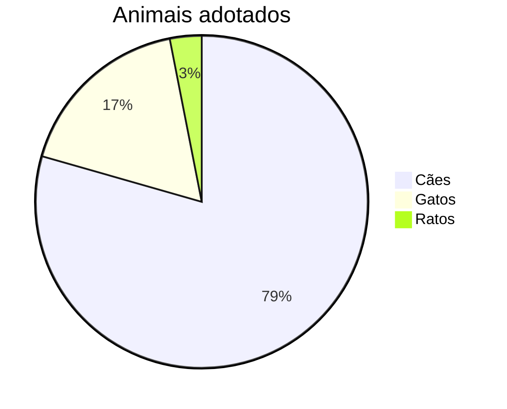

### Sintaxe do gráfico circular

Drawing a pie chart is really simple in mermaid.

* Iniciar com a palavra-chave pie para iniciar o diagrama
* ShowData para apresentar os valores reais dos dados após o texto da legenda. Isto é OPCIONAL
* Seguido da palavra-chave title e do seu valor em string para dar um título ao gráfico circular. Isto é OPCIONAL
* Seguido de dataSet. As fatias da tarte serão ordenadas no sentido dos ponteiros do relógio pela mesma ordem que as etiquetas.
* Etiqueta para uma secção do diagrama circular entre aspas “ ”.
* Seguido de : dois pontos como separador
* Seguido de um valor numérico positivo (suportado até duas casas decimais)

---



### Gráfico circular básico






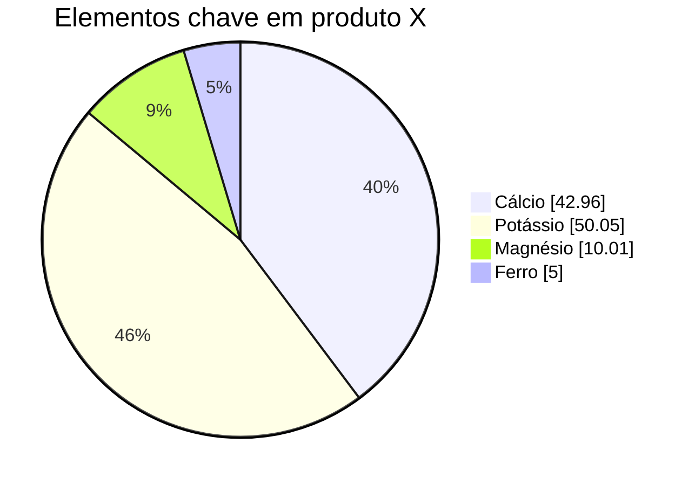

---

## Gráfico de Quadrante

### O que é um gráfico de quadrante

Um gráfico de quadrantes é uma representação gráfica que divide os dados em quatro quadrantes com base em dois eixos. Cada eixo representa uma dimensão ou variável diferente, e os quadrantes são definidos dividindo a área do gráfico em quatro secções iguais. 

Os gráficos de quadrantes são normalmente utilizados para analisar e visualizar relações de dados, particularmente quando se comparam dois conjuntos de variáveis ou critérios. Ajudam a identificar padrões, tendências e valores atípicos no conjunto de dados, permitindo aos utilizadores categorizar os pontos de dados em diferentes quadrantes com base nas suas posições relativamente aos eixos

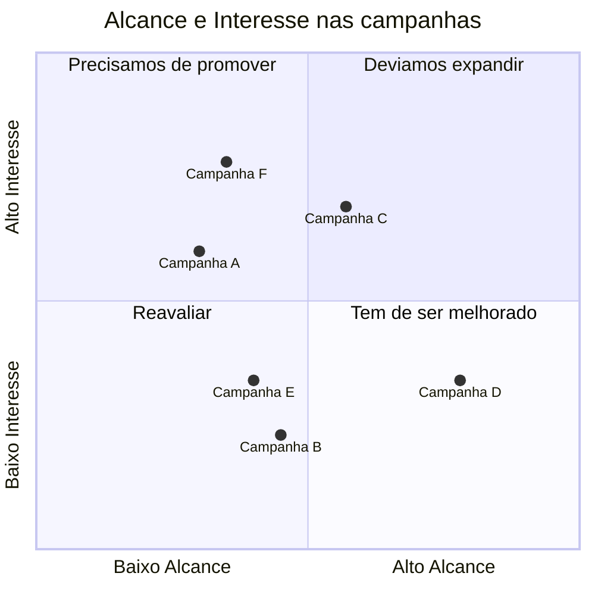
---

### Sintaxe do Gráfico de Quadrantes

* Title
O título é uma breve descrição do gráfico e será sempre apresentado na parte superior do gráfico

Exemplo:
quadrantChart
    title Isto é um gráfico exemplo

* `x-axis`
O eixo x determina o texto que será apresentado no eixo x. No eixo x existem duas partes, esquerda e direita, podendo passar ambas ou apenas a esquerda. A declaração deve começar com o eixo x, depois o texto do eixo esquerdo seguido do delimitador --> e depois o texto do eixo direito.

Exemplo 
x-axis <text> --> <text> tanto o texto do eixo esquerdo como o do eixo direito serão processados.
x-axis <text> apenas o texto do eixo esquerdo será processado.

* `y-axis`
O eixo y determina o texto que será apresentado no eixo y. No eixo y há duas partes, superior e inferior, podendo passar ambas ou apenas a inferior. A declaração deve começar com o eixo y, depois o texto do eixo inferior seguido do delimitador --> e depois o texto do eixo superior.

Exemplo
y-axis <text> --> <text> tanto o texto do eixo inferior como o do eixo superior serão processados.
y-axis <text> apenas o texto do eixo inferior será processado.

* `Quadrants text`
O quadrante-[1,2,3,4] determina o texto que será apresentado no interior dos quadrantes.

Exemplo 
quadrant-1 <text> determinam o texto que será apresentado no quadrante superior direito.
quadrant-2 <text> determinam o texto que será apresentado no quadrante superior esquerdo.
quadrant-3 <text> determina o texto que será apresentado no quadrante inferior esquerdo.
quadrant-4 <text> determina o texto que será apresentado no quadrante inferior direito.

* `Points`
Os pontos são utilizados para traçar um círculo no interior do quadrantChart. A sintaxe é <text>: [x, y], em que os valores x e y se situam no intervalo 0 - 1.

Exemplo 
Point 1: [0.75, 0.80] aqui o Ponto 1 será desenhado no quadrante superior direito.
Point 2: [0.35, 0.24] aqui o Ponto 2 será desenhado no quadrante inferior esquerdo.

---



### Gráfico de quadrantes básico 

Código:


```mermaid
---
title: Basic Quadrant Chart
---
quadrantChart
  x-axis Urgente --> "Não é" urgente
  y-axis "Não é" importante --> "Importante ❤"
  quadrant-1 Planear
  quadrant-2 Fazer
  quadrant-3 Delegar
  quadrant-4 Eliminar

```drant-4 Eliminar
```



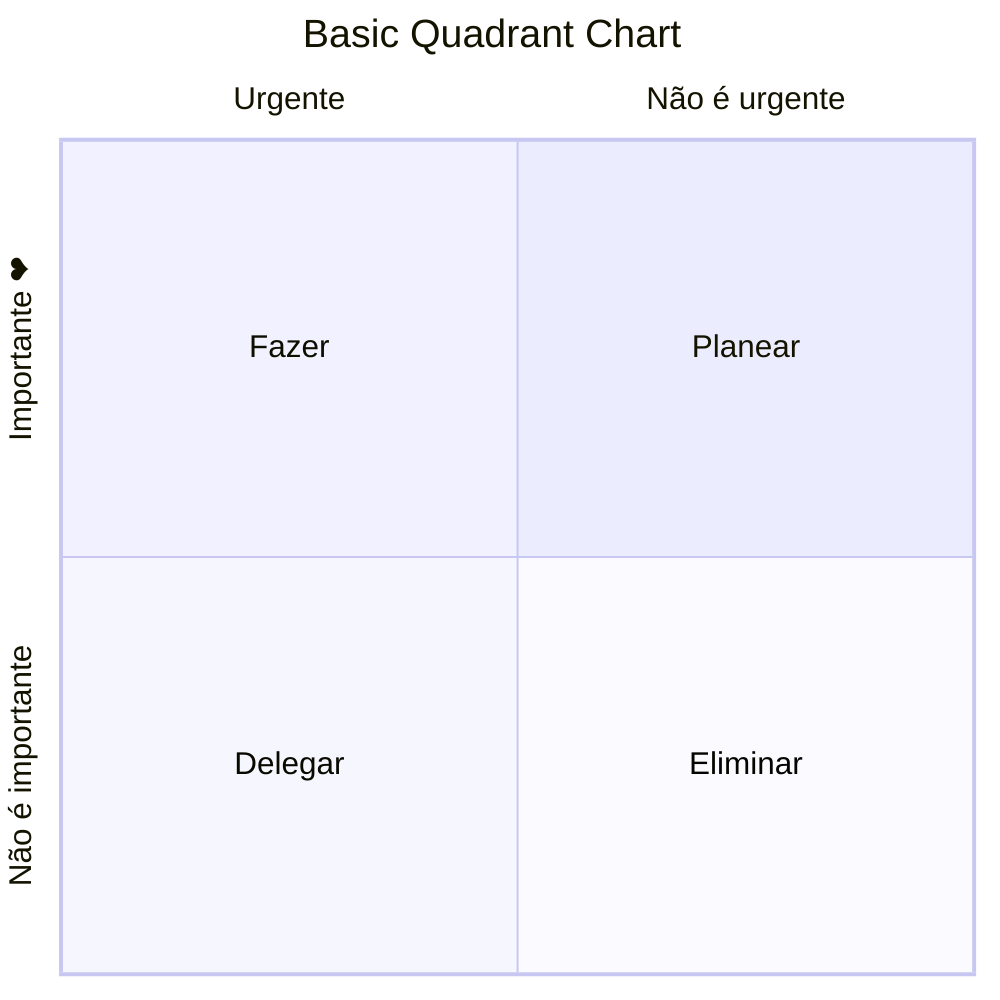
---



--- 

## Diagrama de Classe
### O que é um diagrama de classes

Um diagrama de classe é um tipo de diagrama UML (Unified Modeling Language) que representa a estrutura de um sistema, descrevendo as classes de objetos dentro dele, seus atributos, métodos e as relações entre eles. 

Os diagramas de classes são utilizados principalmente na engenharia de software e na conceção de sistemas para visualizar a estrutura de sistemas orientados para objectos. Fornecem um plano para a conceção de aplicações de software, ajudando os programadores a compreender as relações entre diferentes classes, a planear a implementação de código e a garantir consistência e clareza no processo de conceção.

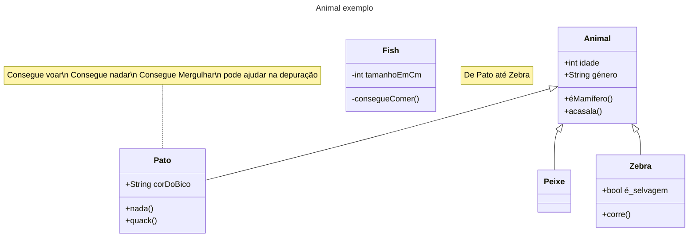

---

### Sintaxe do diagrama de classes

* A UML fornece mecanismos para representar membros de classe, como atributos e métodos, e informações adicionais sobre eles. Uma única instância de uma classe no diagrama contém três compartimentos:

* O compartimento superior contém o nome da classe. Ele é impresso em negrito e centralizado, e a primeira letra é maiúscula. Também pode conter texto de anotação opcional descrevendo a natureza da classe.

* O compartimento do meio contém os atributos da classe. Eles são alinhados à esquerda e a primeira letra é minúscula.

* O compartimento inferior contém as operações que a classe pode executar. Elas também são alinhadas à esquerda e a primeira letra é minúscula.

---



### Diagrama de Classes básico


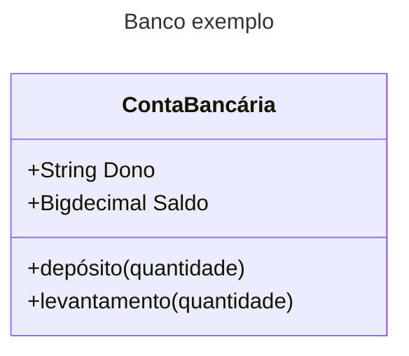



---

## Diagrama de linha do tempo
### O que é um diagrama de linha do tempo

Um diagrama de linha do tempo é uma representação visual que exibe eventos, tarefas ou marcos ao longo de um eixo cronológico. Ele normalmente consiste em barras ou linhas horizontais que representam a duração ou a ocorrência de cada evento, com rótulos ou marcadores indicando pontos-chave no tempo. 

Os diagramas de linha do tempo são utilizados para ilustrar a sequência de eventos ou actividades ao longo de um período, fornecendo uma visão clara e concisa das relações temporais. São normalmente utilizados na gestão de projectos, análise histórica, narração de histórias e visualização de processos

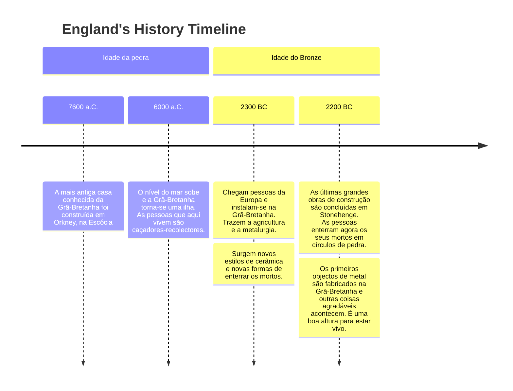

### Sintaxe do diagrama de linha de tempo

* A sintaxe para criar um diagrama de linha do tempo é simples. Começa-se sempre com a palavra-chave timeline para que o Mermaid saiba que se pretende criar um diagrama de timeline.

* Depois disso, há a possibilidade de adicionar um título à linha de tempo. Isto é feito adicionando uma linha com a palavra-chave título seguida do texto do título.

* Em seguida, adiciona os dados da linha cronológica, onde começa sempre com um período de tempo, seguido de dois pontos e do texto do evento. Opcionalmente, pode adicionar um segundo ponto e depois o texto do evento. Assim, pode ter um ou mais eventos por período de tempo.

---



### Diagrama de Linha de Tempo básico


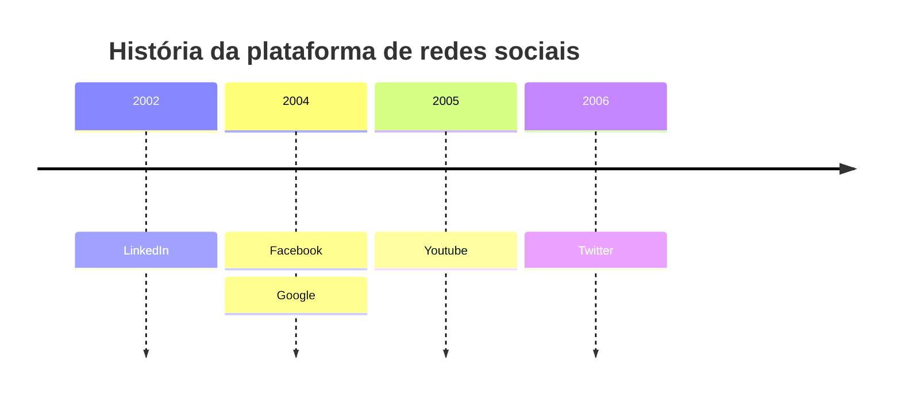


```mermaid
timeline
    title História da plataforma de redes sociais
    2002 : LinkedIn
    2004 : Facebook : Google
    2005 : Youtube
    2006 : Twitter
```
